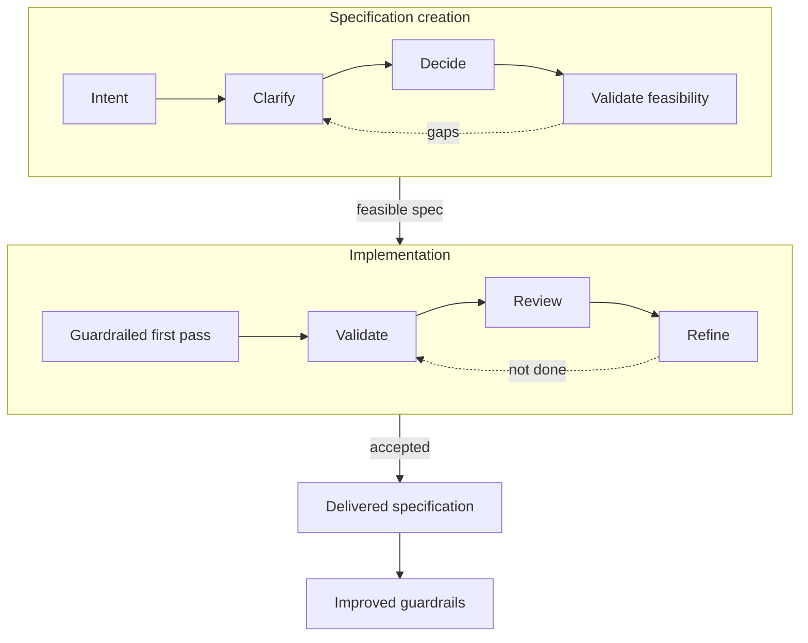

# Human-Agent Development Framework

Version: 0.8.3 Draft

The Human-Agent Development Framework (HADF) is a practical collaboration model for humans and AI coding agents.

It is designed to reduce avoidable implementation loops by making decisions, assumptions, evidence, uncertainty, and ownership visible before they become code.

## What Problem This Solves

AI coding agents can produce code quickly, but the expensive part of agent-assisted development is often not generation. It is convergence: the work required to move from an initial request to an accepted, maintainable implementation.

HADF helps teams reduce convergence cost by defining:

- How humans and agents share responsibility
- How decisions should be owned
- How uncertainty should be surfaced
- How repository standards and existing patterns should guide implementation
- When agents should ask, proceed, stop, validate, or document

## Who This Is For

This framework is intended for:

- Software teams using AI coding agents in real repositories
- Engineers who want higher first-pass acceptance from agent-assisted work
- Technical leads defining agent operating standards
- Teams that want agent speed without losing architectural control or human understanding

## Repository Contents

- `framework.md` - the core framework
- `ADOPTION.md` - practical adoption guidance for teams
- `CHANGELOG.md` - deliberate versioned changes to the framework and templates
- `LICENSE` - license notice and attribution guidance
- `PUBLICATION-CHECKLIST.md` - checks for coherent public draft and stable releases
- `CONTRIBUTING.md` - contribution and feedback guidance
- `examples/` - compact worked examples, including one ambiguity example
- `templates/agents-template.md` - a template for repository-specific agent operating guidance
- `templates/plan-template.md` - a decision-complete implementation plan template for material changes
- `templates/small-change-template.md` - a lightweight template for narrow, reversible changes
- `templates/delivered-spec-template.md` - a template for capturing what was actually delivered

## Start Here

To adopt HADF in a repository:

1. Read `framework.md`.
2. Use `ADOPTION.md` to choose a lightweight, standard, or full adoption path.
3. Copy `templates/agents-template.md` into your repository as `AGENTS.md` or equivalent.
4. Use `templates/small-change-template.md` for small, reversible changes.
5. Use `templates/plan-template.md` for feature work or material changes.
6. Use `templates/delivered-spec-template.md` after material changes.
7. Start with `examples/README.md` when you want to see the expected level of detail.

## Adoption Modes

### Lightweight Adoption

Use the agent operating guidance and small-change template only.

This is appropriate when teams want better agent behavior without introducing a full planning process.

### Standard Adoption

Use the framework, agent operating guidance, small-change template, and plan template.

This is appropriate for teams using agents regularly across production code.

### Full Adoption

Use the framework, all templates, delivered specifications, and framework learning notes.

This is appropriate for teams that want to continuously improve agent-assisted delivery quality over time.

## Core Idea

Every decision left open by a plan becomes a decision the agent may make during implementation.

HADF improves delivery quality by making the right decisions explicit at the right time, with the right owner.

The framework treats delivery as a convergence process:

1. Form a cohesive specification
2. Produce a guardrailed first-pass implementation
3. Validate and improve through focused loops
4. Strengthen guardrails so future loops become fewer and cheaper

## Status

This repository is currently a public draft.

The framework is usable, but the language, templates, and repository structure may continue to evolve before a stable `1.0` release.

## License

This draft is licensed under the Creative Commons Attribution 4.0 International License.

Copyright (c) 2026 Alan Cavanagh.
